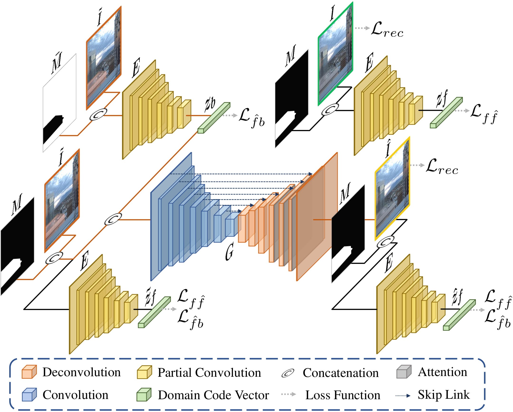
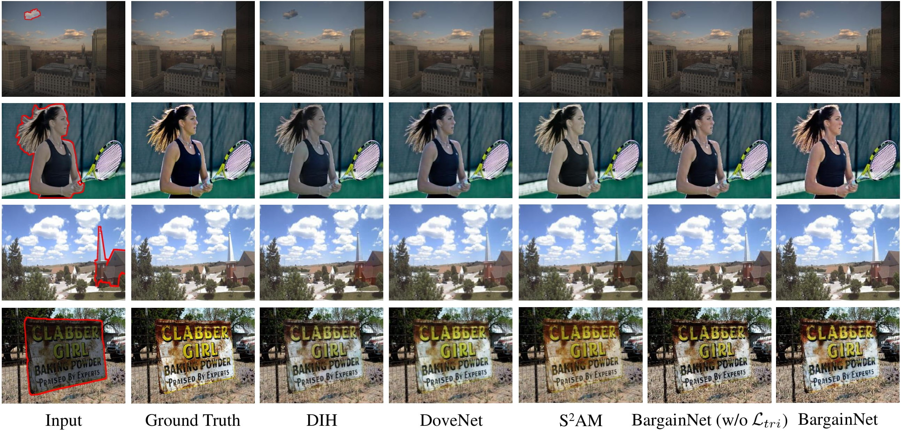
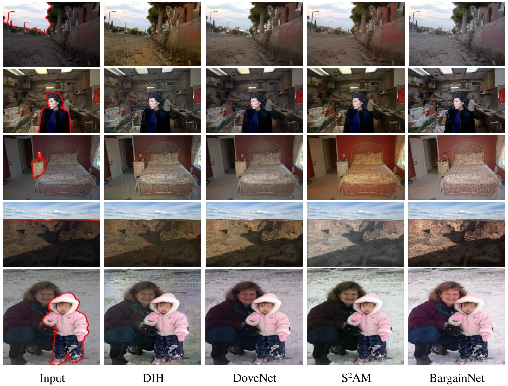
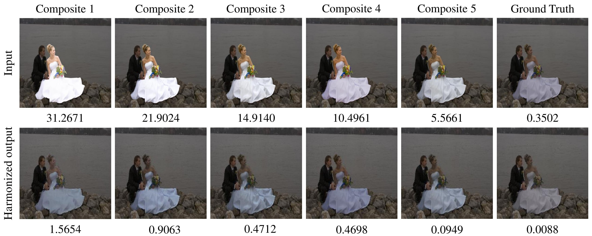

# BargainNet

This repository contains the official PyTorch implementation of the following paper:

> **BargainNet: Background-Guided Domain Translation for Image Harmonization**<br>
>
> [Wenyan Cong](https://wenyancong.com/), [Li Niu](http://bcmi.sjtu.edu.cn/home/niuli/), [Jianfu Zhang](http://scholar.google.com/citations?user=jSiStc4AAAAJ&hl=zh-CN), Jing Liang, Liqing Zhang<br>MoE Key Lab of Artificial Intelligence, Shanghai Jiao Tong University<br>
> https://arxiv.org/abs/2009.09169<br>Accepted by **ICME2021** as **Oral**.

 **Part of our BargainNet has been integrated into our image composition toolbox libcom https://github.com/bcmi/libcom. Welcome to visit and try ＼(^▽^)／** 

**Our domain code extractor can extract the domain code of an image region, which contains the illumination information.** The domain codes can be used to measure the illumination compatibility between different regions.

## Introduction


In this work, we treat different capture conditions as different domains. Therefore, the foreground and background of real images captured in the same condition belong to the same domain. The foreground and background of composite images belong to two different domains. In this case, image harmonization could be regarded as transferring the foreground domain to the background domain, making it a special case of domain translation. However, in our task, the domain labels are hard to define and hard to solicit from users. So inspired by example-guided domain translation, we formulate image harmonization task as **background-guided domain translation**, which provides a new perspective for image harmonization.



The network architecture of our BargainNet consists of attention enhanced U-Net generator G and domain code extractor E. The domain code extractor could extract the domain code for a region with an irregular shape. We employ two types of triplet losses based on four types of domain codes. The test phase is highlighted with red flow lines for clarity.



Our method could generate more favorable results with consistent foreground and background.


In addition, by inverting the mask fed into the generator and the domain code extractor in the testing stage, our BargainNet could be easily applied to background harmonization, which adjusts the background to make it compatible with the foreground.



Based on the extracted domain codes of foreground and background, we can predict the inharmony level of a composite image by calculating the Euclidean distance between two domain codes, reflecting to which extent the foreground is incompatible with the background. Inharmony level provides an intuitive perspective for inharmony assessment, which is an enticing byproduct of our method and useful for image harmonization related tasks.

## Training

`python train.py  --name <experiment_name> --model bargainnet --dataset_mode iharmony4 --is_train 1  --norm batch --preprocess resize_and_crop --gpu_ids 0  --save_epoch_freq 1 --input_nc 20 --lr 1e-4 --beta1 0.9  --lr_policy step --lr_decay_iters 6574200 --netG s2ad`

Remember to specify `name` in the corresponding place. By default, the trained model will be saved in `./checkpoints/<experiment_name>` directory.

To view training results and loss plots, run `python -m visdom.server` and click the URL [http://localhost:8097](http://localhost:8097/). To see more intermediate results, you can check out visdom or `./checkpoints/<experiment_name>/web/index.html`.  Please read the options for more details.

## Evaluation

Our trained model can be downloaded from [Baidu Cloud](https://pan.baidu.com/s/1AYMKS8AieLzO5RoXj0ASRQ) (access code: adr4) or [Dropbox](https://www.dropbox.com/scl/fi/c5ah5btrksk99aa1qdxiy/BargainNet_pretrained_models.zip?rlkey=3vvxxdzesog1b476czxnbjdt5&st=8lg2eof7&dl=0). Download and put it under `./checkpoints/<experiment_name>/`. To test and re-produce the reported results in our paper, run:

`python test.py  --name <experiment_name>  --model bargainnet --dataset_mode iharmony4 --is_train 0  --norm batch --preprocess resize --gpu_ids 0  --input_nc 20 --netG s2ad`

When testing, it prints the results of evaluation metrics MSE, PSNR, and fMSE. It also saves the harmonized outputs in `./results/<experiment_name>/latest_test/images/`


## Harmony Score

Given a composite image, we can extract the domain codes of foreground and background, and measure their similarity which is normalized within [0,1]. The normalized similarity score is referred to as harmony score. Larger harmony score implies more harmonious composite image. 

To predict harmony score for a composite image, download the pretrained model and save it to the directory `checkpoints`, then run:

`python predict_harmony_score.py --image <composite-image-path> --mask <foreground-mask-path>`

In the directory `examples`, we provide several pairs of composite images and associated foreground masks.

## Other Resources

+ [Awesome-Image-Harmonization](https://github.com/bcmi/Awesome-Image-Harmonization)
+ [Awesome-Image-Composition](https://github.com/bcmi/Awesome-Object-Insertion)


## Bibtex
If you find this work is useful for your research, please cite our paper using the following **BibTeX  [[pdf]()] [[supp]()] [[arxiv](https://arxiv.org/abs/2009.09169)]:**

```
@inproceedings{BargainNet2021,
title={{BargainNet}: Background-Guided Domain Translation for Image Harmonization},
author={Wenyan Cong and Li Niu and Jianfu Zhang and Jing Liang and Liqing Zhang},
booktitle={ICME},
year={2021}}
```

